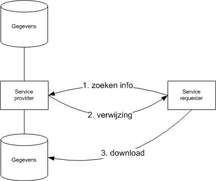
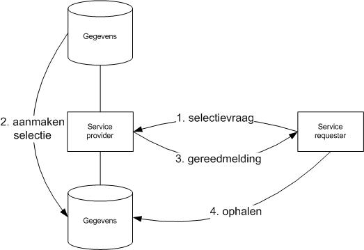
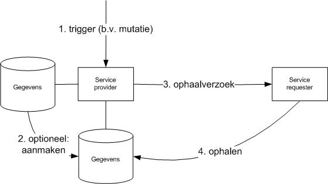
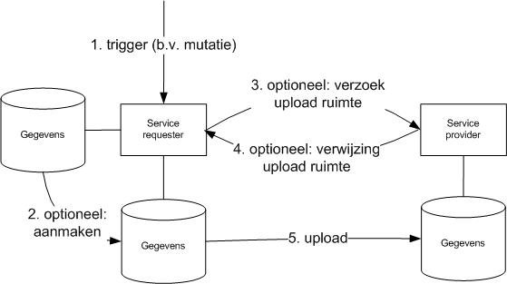

# Inleiding
## Doel en doelgroep

Dit document beschrijft een aantal Best Practices voor de DigiKoppeling Grote Berichten.

Het document is bestemd voor architecten en ontwikkelaars die op basis van DigiKoppeling Grote Berichten gegevens willen uitwisselen. Zie onderstaande tabel bij welke taken dit document ondersteunt. De koppelvlakstandaard Grote Berichten beschrijft verplichtingen voor het toepassen van Grote Berichten. Dit document is een aanvulling hierop en heeft tot doel ontwikkelaars te informeren en adviseren over de te volgen werkwijze bij het toepassen van de Koppelvlakstandaard Grote Berichten.

| Afkorting | Rol                             | Taak                                                                                                       | Doelgroep? |
| --- |---------------------------------| --- |------------|
| [MT]      | Management                      | Bevoegdheid om namens organisatie (strategische) besluiten te nemen.                                       | **Nee**    |
| [PL]      | Projectleiding                  | Verzorgen van de aansturing van projecten.                                                                 | **Nee**    |
| [A&D]     | Analyseren & ontwerpen (design) | Analyseren en ontwerpen van oplossings-richtingen. Het verbinden van Business aan de IT.                   | **Nee**    |
| [OT&B]    | Ontwikkelen, testen en beheer   | Ontwikkelt, bouwt en configureert de techniek conform specificaties. Zorgen voor beheer na ingebruikname.  | **Ja**     |

## Opbouw Digikoppeling documentatie

Digikoppeling is beschreven in een set van documenten. Deze set is als volgt opgebouwd:


## Doel en scope van Digikoppeling

DigiKoppeling biedt de mogelijkheid om op een sterk gestandaardiseerde wijze berichten uit te wisselen tussen service aanbieders en service afnemers. De uitwisseling tussen partijen wordt in drie lagen opgedeeld:

- Inhoud: Op deze laag worden de afspraken gemaakt over de inhoud van het uit te wisselen bericht, dus de structuur, semantiek en waardebereiken.  
    DigiKoppeling houdt zich **niet** met de inhoud bezig, ‘heeft geen boodschap aan de boodschap’.

- Logistiek: Op deze laag bevinden zich de afspraken betreffende transportprotocollen (HTTP), messaging (SOAP), beveiliging (authenticatie en encryptie) en betrouwbaarheid. **Dit is de DigiKoppeling-laag.**

- Transport: deze laag verzorgt het daadwerkelijke transport van het bericht.

DigiKoppeling richt zich dus uitsluitend op de logistieke laag. Deze afspraken staan in de koppelvlakstandaards en andere voorzieningen. In het geval van WUS en ebMS2 komt de logistieke laag overeen met de ‘header’ van het bericht en gaat de ‘body’ uitsluitend over de inhoud. In het geval van Digikoppeling Grote Berichten is een deel van de logistieke informatie opgenomen in de ‘body’ van het bericht in de vorm van gestandaardiseerde meta-data.

### Leidend principe

De koppelvlakstandaarden dienen te leiden tot een maximum aan interoperabiliteit met een minimum aan benodigde ontwikkelinspanning. Daarom wordt gekozen voor bewezen interoperabele internationale standaarden.

DigiKoppeling maakt berichtenuitwisseling mogelijk op basis van de ebXML/ebMS2 en WUS families van standaarden inclusief de daarbij behorende verwante standaarden.

Aan te sluiten overheidsorganisaties hebben aangegeven op een uniforme manier (één stekker) te willen aansluiten aan DigiKoppeling. Organisaties die beschikken over eigen middleware (ESB, broker) kunnen de aansluiting aan DigiKoppeling, de adapters, in het algemeen realiseren via voorzieningen in die middleware.

## Koppelvlak & koppelvlakstandaard

Een koppelvlak is een interface die volgens vergaande standaards de gegevensuitwisseling verzorgt. Het werken met vaste standaards is essentieel voor een koppelvlak. Hierdoor wordt implementatie vergemakkelijkt. Ook wordt het mogelijk diverse soorten berichten door te sturen met een grote mate van interoperabiliteit.

Eén van de belangrijkste eisen die door de overheid gesteld wordt bij de inrichting van generieke voorzieningen is dat er niet veel maatwerk ontwikkeld hoeft te worden, maar dat er van “off the shelf” commercieel of OPEN geleverde software gebruik gemaakt kan worden. Voor DigiKoppeling, dus voor de logistieke laag, betreft dat het niet willen ontwikkelen van software voor de adapters.

Dit doel kan bereikt (benaderd) worden doordat gekozen wordt voor internationale (de jure of de facto) vastgelegde standaards, die door “alle” leveranciers interoperabel zijn geïmplementeerd. Ingeval van Grote Berichten is gebruik gemaakt van een optioneel deel uit de http 1.1 standaard. Hierdoor is het mogelijk om de overdracht te hervatten op het punt van afbreken door een toevallige storing. Zowel standaard servers als clients ondersteunen dit, maar aan de client kant moet de optie ook expliciet gebruikt worden.

Een andere eis is dat met name afnemers gebruik kunnen maken van één “stekker” (één logistiek koppelpunt).

### Specificatie van de koppelvlakstandaard

De koppelvlakspecificatie beschrijft de eisen waar de adapters aan moeten

voldoen om interoperabel met elkaar te kunnen communiceren.

DigiKoppeling gaat over logistiek, dus over de envelop en niet over de

inhoud. De hele set info die tezamen nodig is voor een complete generieke

DigiKoppeling koppelvlakdefinitie (Raamwerk Specificatie genoemd)

bestaat uit:

- interfacedefinitie “on the wire”, (voorbeeld)listing van SOAP headers, en

- informatie over velden en hun specifieke inhoud.

## Opbouw van dit document

Hoofdstuk 1 bevat een aantal algemene inleidende onderwerpen. Hoofdstuk 2 beschrijft de Best Practices voor verschillende scenario's. Hoofdstuk 3 ten slotte bevat generieke use-cases waarin van deze standaard gebruik gemaakt kan worden.

Begrippen en afkortingen worden toegelicht in het document “Digikoppeling_Architectuur”. Deze zit in de Digikoppeling aansluitkit.

Dit document en andere documentatie is beschikbaar op [www.logius.nl/digikoppeling](http://www.logius.nl/digikoppeling)

# Best Practices

## Inleiding

De situatie kan zich voordoen dat een WUS en/of ebMS2 bericht een grootte krijgt die niet meer efficiënt door de WUS / ebMS2 adapters verwerkt kan worden. Ook kan het zich voordoen dat er behoefte bestaat aan het buiten de normale procesgang ('out-of-band') sturen van aanvullende informatie naar systemen. In die gevallen zal dit “grote bericht” op een andere wijze verstuurd moeten worden: middels de DigiKoppeling Koppelvlakstandaard Grote Berichten.

De volgende standaard aanpak wordt hierbij gehanteerd:

- De verzender stelt een bestand samen uit (een deel van) de gegevens die normaliter in het “grote bericht” verzonden zou worden. Het resultaat wordt aangeduid met de term “groot bestand”. Merk op dat dit ook een “groot” xml bestand kan zijn, een CAD bestand, een PDF document, een ZIP bestand, et cetera.

- De verzender stelt metadata samen over het grote bestand en verstuurt deze metadata in een WUS- of ebMS2-bericht [in een zgn. stuurbericht]. Merk op dat het stuurbericht naast metadata ook voorzien kan zijn van inhoudelijke informatie die al nodig is bij ontvangst van het bericht voorafgaand aan het nog op te halen grote bestand.

- De ontvanger haalt het grote bestand op via het gespecificeerde HTTP 1.1 protocol op basis van de verstrekte metadata (zoals in de koppelvlakstandaard is gespecificeerd). De bestandsoverdracht is niet “betrouwbaar”; indien dit wel gewenst is, dient de ontvanger aanvullende maatregelen te implementeren (retry-mechnisme, foutafhandeling). De Koppelvlakstandaard bevat hiervoor handvatten. Toepassing van deze handvatten in concrete implementaties vallen buiten de scope van het koppelvlak.

De standaard doet geen uitspraak over gegevensstromen waarin kleine en grote berichten voorkomen. Bij implementatie van dergelijke gegevensstromen zal een organisatie moeten afwegen of kleine berichten anders of gelijk aan de ‘echte’ grote berichten verwerkt worden. In z’n algemeenheid zal een uniforme afhandeling eenduidiger en vooral ook eenvoudiger zijn; slechts in bijzondere gevallen zal dit niet volstaan.

## Interactiepatronen

Afhankelijk van de situatie zijn verschillende interactiepatronen mogelijk. Deze patronen verschillen qua initiatief en qua aanpak.

### Halen

Er is bij grote berichten sprake van halen, wanneer een groot bestand door de ontvangende partij wordt opgehaald. Voorafgaand aan deze actie dient altijd een meta-bericht verstuurd te worden door de verzender.

#### EbMS2

Bij het Melden van grote hoeveelheden informatie dient van ebMS2 gebruik gemaakt te worden. Met ebMS2 kan de ontvangst van de metadata gegarandeerd worden.

De volgende aanpak is hierbij gebruikelijk:

- De verzender stelt een groot bestand samen voor de overdracht.

- De verzender stelt de metadata samen en verstuurt deze via ebMS2.

- De ontvanger haalt het grote bestand op.

Ook bij het Bevragen van grote hoeveelheden informatie kan van ebMS2 gebruik gemaakt worden. In dat geval gaat er een ebMS2 bevraging vooraf aan bovenstaande (terug-) Melding.

Toepassingen:

- Verzenden van grote hoeveelheden informatie.

- Distributie van grote hoeveelheden informatie.

Een alternatieve aanpak is:

- De verzender stelt de metadata samen en verstuurt deze via ebMS2.

- De ontvanger haalt het grote bestand op.

- De verzender genereert 'real-time' tijdens het ophalen de benodigde data.

Toepassingen:

- Noodzaak tot beperken van opslagcapaciteit voor grote bestanden.

- Tijdkritische omgevingen.

Merk op dat de metadata de checksum van het grote bestand bevat. Deze werkwijze vereist daarom dat de checksum al vooraf is bepaald. Vaak zal aan deze voorwaarde niet voldaan kunnen worden.

#### WUS

Bij het Bevragen van grote hoeveelheden informatie kan naast ebMS2 (zie hiervoor) ook van WUS gebruik gemaakt worden. Hierbij wordt dan een meta-bericht en een bijbehorende groot bestand gegenereerd. Het meta-bericht wordt als antwoord op het WUS-request verstuurd via de synchrone WUS-response. Dit kan vervolgens door de ontvanger gebruikt worden om het betreffende grote bestand op te halen.

Het toepassen van WUS voor Bevraging met Grote Berichten heeft wel enkele lastige eisen. WUS is een synchroon protocol waarin time-outs toegepast worden bij het uitblijven van een response op het request. Daarom is weinig tijd beschikbaar voor het genereren van een response bericht. Dit vereist daarom dat aan één van de volgende eisen is voldaan:

- Het grote bestand is al gereed op het moment van de WUS bevraging.

- Het grote bestand kan snel voor of tijdens het ophalen gegenereerd worden én de checksum is vooraf bekend.

Toepassingen:

- Opvragen van grote hoeveelheden informatie.

- Opvragen van (afgesloten) log-bestanden.

### Brengen

Er is bij grote berichten sprake van brengen, wanneer een groot bestand voorafgaand aan het meta-bericht door de verzender op een afgesproken plaats wordt klaargezet. Aansluitend op deze actie dient altijd een meta-bericht verstuurd te worden door de verzender.

De volgende aanpak wordt hierbij gehanteerd:

- De verzender stelt een groot bestand samen en verstuurt deze via HTTP.

- De verzender stelt de metadata samen en verstuurt deze via ebMS of WUS.

- De ontvanger verwerkt het grote bestand.

Het brengen interactiepatroon kan niet plaatsvinden op basis van de huidige versie van de koppelvlakstandaard. Het Technisch Overleg Digikoppeling heeft om redenen van veiligheid en gebrek aan behoefte geen uitwerking gegeven aan dit interactiepatroon. De koppelvlakstandaard is wel voorbereid op een toekomstige toevoeging van dit interactiepatroon mocht dit gewenst zijn.

## Metadata

De metadata beschrijft de informatie over het bestand dat verstuurd wordt met HTTP 1.1. De metadata zelf wordt verzonden via het WUS/ebMS2 Koppelvlak. Ten behoeve van toekomstige vernieuwingen bevat de metadata een versienummer (‘profile’-waarde).

### Location URL

De URL voor het ophalen of aanleveren van grote berichten moet uniek zijn; hierbij kan gebruik gemaakt worden van een UUID om een (fysieke) bestandsnaam te genereren. Daarnaast kan ook aanvullende informatie aan de URL worden toegevoegd om deze enigszins te structureren.

Bijvoorbeeld:

>   https://my.host.nl/f47ac10b-58cc-**4**372-**a**567-0e02b2c3d479

Of ingedeeld naar (OIN van de) ontvanger:

>   https://my.host.nl/01234567890123456789/f47ac10b-58cc-4372-a567-0e02b2c3d479

Of ingedeeld naar datum/tijd:

>   https://my.host.nl/2010/09/01/f47ac10b-58cc-4372-a567-0e02b2c3d479

Het default poortnummer is 443; het gebruik van afwijkende poortnummers is alleen met wederzijdse instemming toegestaan:

>   [https://my.host.nl:8443/](https://my.host.nl:8443/f47ac10b-58cc-4372-a567-0e02b2c3d479)[f47ac10b-58cc-](https://my.host.nl:8443/f47ac10b-58cc-4372-a567-0e02b2c3d479)[4](https://my.host.nl:8443/f47ac10b-58cc-4372-a567-0e02b2c3d479)[372-](https://my.host.nl:8443/f47ac10b-58cc-4372-a567-0e02b2c3d479)[a](https://my.host.nl:8443/f47ac10b-58cc-4372-a567-0e02b2c3d479)[567-0e02b2c3d479](https://my.host.nl:8443/f47ac10b-58cc-4372-a567-0e02b2c3d479)

De URL hoeft niet altijd naar een fysiek bestand te verwijzen; de response voor de URL mag ook dynamisch worden opgebouwd. Wel geldt hierbij dat de response voor opeenvolgende requests identiek moet zijn, omdat anders geen checksum bepaald kan worden.

### Bestandsnaam

Voor ieder groot bestand dient een unieke lokale bestandsnaam bepaald te worden. De opgegeven bestandsnaam uit de metadata is uniek voor de gegeven context, zodat deze geschikt is als lokale bestandsnaam. Wel kunnen de eisen ten aanzien van bestandsnamen voor ieder platform verschillen; daarom kan de opgegeven bestandsnaam uit de metadata ook niet altijd zonder transformatie aan de zijde van de ontvanger gebruikt worden. Transformatie is bijvoorbeeld nodig als de ontvanger geen bestandsnaam van 200 posities kan verwerken of niet overweg kan met Unicode-karakters als bestandsnaam.

Als basis voor lokale bestandsnamen kan ook gebruik gemaakt worden van het bericht-id van de metadata of van de location-url, waarvan voor beide de uniciteit gegarandeerd kan worden. Een andere optie is om zelf een unieke bestandsnaam te genereren, gebruikmakend van de metadata en aangevuld met tenminste één unieke component (bericht-id, location-url of UUID).

Voorbeelden:
>   sample.xml-c3c3281c-e561-4be8-8519-4e9690fb0f08
>   c3c3281c-e561-4be8-8519-4e9690fb0f08.xml
>   https-my.host.nl-f47ac10b-58cc-**4**372-**a**567-0e02b2c3d479

### Metadata als deel van een bericht

Metadata hoeft niet altijd als een afzonderlijk bericht verzonden te worden. Het is ook toegestaan om metadata met andere parameters te combineren in één bericht. Het verschil tussen gewone services en “grote berichten” services beperkt zich dus alleen tot de wijze waarop de “payload” wordt aangeleverd.

```XML
<?xml version="1.0" encoding="UTF-8"?>
<embedded-meta xmlns:tns="http://www.logius.nl/digikoppeling/gb-embedded/" xmlns:gb="http://www.logius.nl/digikoppeling/gb/2010/10" xmlns:xsi="http://www.w3.org/2001/XMLSchema-instance" xsi:schemaLocation="http://www.logius.nl/digikoppeling/gb/ gb-embedded.xsd ">
	<andere-data>
		Hier kan van alles staan, tekst of andere tags .
	</andere-data>
	<digikoppeling-external-data-references profile="digikoppeling-gb-1.0">
		<data-reference contextId="1201">
			<lifetime />
			<content contentType="">
				<filename>
					NCName
				</filename>
				<checksum type="MD5">
					0123456789012345678901234567890123456789
				</checksum>
				<size>
					1024
				</size>
			</content>
			<transport>
				<location>
					<senderUrl type="xs:anyURI">
						https://my.host.nl/12345-2-c3c3281c-e561-4be8-8519
					</senderUrl>
				</location>
			</transport>
		</data-reference>
	</digikoppeling-external-data-references>
</embedded-meta>
```

Essentieel voor GB is hierbij de *data-reference* tag; het gebruik van de *digikoppeling-external-data-references* tag is hierbij niet noodzakelijk. In plaats daarvan kan ook een tag uit de target namespace gebruikt worden, afhankelijk van het bijbehorende schema:

```XML
<?xml version="1.0" encoding="UTF-8"?>
<embedded-meta xmlns:tns="http://www.logius.nl/digikoppeling/gb-embedded/" xmlns:gb="http://www.logius.nl/digikoppeling/gb/2010/10" xmlns:xsi="http://www.w3.org/2001/XMLSchema-instance" xsi:schemaLocation="http://www.logius.nl/digikoppeling/gb/ gb-embedded.xsd ">
	<data>
		<id>
			tns:id
		</id>
		<version>
			tns:version
		</version>
		<result profile="digikoppeling-gb-1.0">
			<data-reference contextId="1201">
				<lifetime />
				<content contentType="">
					<filename>
						NCName
					</filename>
					<checksum type="MD5">
						0123456789012345678901234567890123456789
					</checksum>
					<size>
						1024
					</size>
				</content>
				<transport>
					<location>
						<senderUrl type="xs:anyURI">
							https://my.host.nl/12345-2-c3c3281c-e561-4be8-8519
						</senderUrl>
					</location>
				</transport>
			</data-reference>
		</result>
	</data>
</embedded-meta>

```

De bijbehorende XSD zou hierbij als volgt gedefinieerd kunnen worden:

```XML
<?xml version="1.0" encoding="UTF-8"?>
<schema xmlns:xs="http://www.w3.org/2001/XMLSchema" xmlns:gb="http://www.logius.nl/digikoppeling/gb/2010/10" xmlns:tns="http://www.logius.nl/digikoppeling/gb/embedded/" elementFormDefault="qualified" attributeFormDefault="unqualified" targetNamespace="http://www.logius.nl/digikoppeling/gb/embedded/">
	<import namespace="http://www.logius.nl/digikoppeling/gb/2010/10" schemaLocation="gb-1.0.xsd" />
	<element name="embedded-meta" type="tns:data" />
	<complexType name="data">
		<sequence>
			<element name="id" type="xs:string" />
			<element name="version" type="xs:string" />
			<element name="result" type="gb:external-data-references" />
		</sequence>
	</complexType>
</schema>
```

### Meerdere bestanden in één bericht

Niet ieder groot bestand hoeft als een afzonderlijk bericht verzonden te worden. Het is ook toegestaan om meerdere bestanden te combineren in één bericht. Voor ieder afzonderlijk bestand dient dan wel een afzonderlijke data-reference te worden opgenomen in het bericht.

```XML
<schema xmlns:xs="http://www.w3.org/2001/XMLSchema" elementFormDefault="qualified" profile="digikoppeling-gb-1.0" xmlns:tns="http://www.logius.nl/digikoppeling/gb/2010/10" xmlns:xsi="http://www.w3.org/2001/XMLSchema-instance" xi:schemaLocation="http://www.logius.nl/digikoppeling/gb/2010/10/gb-meta.xsd">
	<data-reference contextId="12345-1">
		<lifetime />
		<content contentType="application/xml">
			<filename>
				Bijlage-1NCName
			</filename>
			<checksum type="MD5">
				0123456789abcdef0123456789abcdef
			</checksum>
			<size>
				1024
			</size>
		</content>
		<transport>
			<location>
				<senderUrl type="xs:anyURI">
					https://my.host.nl/12345-1-c3c3281c-e561-4be8-8519
				</senderUrl>
			</location>
		</transport>
	</data-reference>
	<data-reference contextId="12345-2">
		<lifetime />
		<content contentType="application/xml">
			<filename>
				Bijlage-2
			</filename>
			<checksum type="MD5">
				0123456789abcdef0123454321abcdef
			</checksum>
			<size>
				2048
			</size>
		</content>
		<transport>
			<location>
				<senderUrl type="xs:anyURI">
					https://my.host.nl/12345-2-c3c3281c-e561-4be8-8519
				</senderUrl>
			</location>
		</transport>
	</data-reference>
</schema>

```

### Geldigheidsduur

Door een beperking op te leggen aan de beschikbaarheid wordt voorkomen dat het niet duidelijk is wanneer een bestand weer verwijderd zou mogen worden. Daarom ligt het voor de hand om altijd een expiratiedatum in de metadata op te nemen.

Wanneer echter op een andere wijze duidelijk gemaakt wordt wanneer een bestand verwijderd kan worden, bijvoorbeeld door een terugmelding vanuit de applicatie, dan kan de expiratiedatum

wellicht worden weggelaten.

Houdt er mee rekening dat een bestandsoverdracht niet binnen een afgesproken tijdsduur of voor expiratie van het bestand voltooid kan worden. Neem voorzorgsmaatregelen door in zo'n geval bijvoorbeeld de overdracht af te breken op basis van een time-out.

### Context

In het geval van Digikoppeling Grote Berichten is sprake van minimaal twee uitwisselingen waarvan het belang is om de samenhang te bewaken:

1. bericht met de meta-data;

1. bestand dat naar aanleiding hiervan opgehaald wordt.

Het bewaken van de samenhang wordt extra belangrijk als er (tegelijkertijd) meerdere gegevensstromen zijn. Een oplossing verschilt per implementatie en kent algemeen de volgende mogelijkheden:

- Verzender standaard  
    Een verzender van het grote bericht heeft geen moeite om de context te bewaken. De applicatie die het grote bestand aanmaakt zal in hetzelfde proces ook metadata aanmaken. Bij ophalen van het bestand vormt de url waarmee deze opgehaald wordt de referentie voor de bestandserver. Om de oplossing robuuster te maken kan de contextID uit de metadata aanvullend overgenomen worden in het bestand. Onderstaande mogelijkheden hebben verder alleen betrekking op het bewaken van de context aan de ontvanger kant.

- Contextbewaking door applicatieserver (WUS)  
    De ontvanger die via een synchrone WUS-response metadata ontvangt kan in dezelfde procesgang het bestand ophalen. Bewaken van de context vindt dan door de applicatieserver plaats die na verzending van het request een proces ‘on hold’ zet en bij binnenkomst van een response het proces opstart dat hier op stond te wachten.

- Contextbewaking met expliciete referentie (ebMS2)  
    In het geval van ebMS2 kan als standaard oplossing een referentie meegegeven worden. Dit kan door deze op te nemen in de contextID van de metadata. Bij voorkeur komt deze overeen met de MessageID of ConversationID van het bericht:

1. Als het bestand specifiek bij één bericht hoort: MessageID

1. Als het bestand bij een conversatie van meerdere berichten hoort of als een conversatie maar één bericht bevat: ConversationID.

    Om de oplossing robuuster te maken kan de contextID uit de metadata aanvullend overgenomen worden in het bestand.

- Contextbewaking met expliciete referentie (WUS)  
    In het geval van synchrone WUS maar ook bij asynchrone WUS (geen Digikoppeling!) kan als standaard oplossing een referentie meegegeven worden. Dit kan bijvoorbeeld door de applicatie de referentie in de body te laten opnemen. Beter is het echter om dit conform Digikoppeling in de header op te nemen. In het request wordt de referentie dan opgenomen in de MessageID van het WUS-request. De service geeft deze MessageID dan terug als 'contextID' in de (synchrone of asynchrone) WUS-response<sup>1</sup>. Om de oplossing robuuster te maken kan de contextID uit de metadata aanvullend overgenomen worden in het bestand.

<sup>1</sup>: Volgens de WUS koppelvlakstandaard zal ook het headerveld “RelatesTo” van de response overeenkomen met het MessageID van het request.

## Reliability

### Retry strategie

De bestandsoverdracht is niet “betrouwbaar”; daarom dient de ontvanger een retry mechanisme te implementeren om toch betrouwbaarheid te kunnen afdwingen.

Op basis van het retry mechanisme zal in voorkomende foutsituaties getracht worden om de bestandsoverdracht te hervatten. Hierbij kan het voorkomen dat de bestandsoverdracht telkens wordt onderbroken, maar ook dat bepaalde service tijdelijk niet beschikbaar is (service window).

Door het tijdsinterval variabel te maken kan worden voorkomen dat onnodig vaak retries hoeven te worden uitgevoerd, zonder dat hierdoor betrouwbaarheid verloren gaat. Kortere intervallen zijn hierbij zinvol bij onderbrekingen van de bestandsoverdracht, terwijl langere intervallen gebruikt kunnen worden om gaten in de beschikbaarheid te kunnen overbruggen (server uitval, service window, etc.).

Wanneer er fatale fouten geconstateerd worden of wanneer de geldigheidsduur van een bestand verstreken is, dan zijn verdere retries niet zinvol en dient de bestandsoverdracht te worden afgebroken (give-up).

**Opmerking**

De noodzaak van een retry-mechanisme doet geen afbreuk aan de standaard. Ook ebMS2 (betrouwbaar protocol) kent beperkingen in het aantal retries en retry-intervallen.

### Foutafhandeling

Indien een bestandsoverdracht niet succesvol voltooid kan worden, dan dienen het meta-bericht, bijbehorende log-bestanden en het eventuele grote bestand bewaard te worden voor een latere handmatige verwerking.

Het koppelvlak schrijft niet voor hoe te handelen bij optredende foutsituaties; het is de verantwoordelijkheid van de applicaties om hiervoor een adequate oplossing te bieden. Enerzijds zou de ontvanger de bestandsoverdracht kunnen monitoren en eventuele foutsituaties melden aan de verzender; anderzijds kan het ontbreken van een bevestiging voor de verzender aanleiding zijn om actie te ondernemen.

Belangrijkste foutsituaties bij bestandsoverdracht:

| Statuscode | Omschrijving          | Vervolgactie                                                                                             |
| --- |-----------------------| --- |
| 200        | OK                    | Indien de ontvangst van data wordt onderbroken, dan een nieuwe Range-request; anders GEEN.               |
| 206        | Partial Content       | Idem.                                                                                                    |
| 403        | Forbidden             | Authenticatie probleem; verder proberen is niet zinvol.                                                  |
| 404        | Not Found             | Url niet beschikbaar; verder proberen is niet zinvol, tenzij de geldigheidsperiode nog niet is ingegaan. |
| 416        | Range Not Satisfiable | Probleem met byte range; verder proberen is niet zinvol.                                                 |
| 500+       | Internal Server Error | Server probleem; later opnieuw proberen.                                                                 |

## Security

### OIN en certificaten

Ten behoeve van DigiKoppeling grote berichten dient gebruik gemaakt te worden van OIN gerelateerde certificaten. Alleen verbindingen waarbij zowel de client als de server over een geldig certificaat beschikken zijn toegestaan (TLS). De gebruikte certificaten mogen dezelfde certificaten zijn die al ten behoeve van ebMS2 / WUS geïnstalleerd zijn, maar dit hoeft niet het geval te zijn (zolang het OIN maar overeenkomt).

#### Client-zijde

Strik genomen moeten zowel de server als de client controleren op OIN; d.w.z. het OIN uit het certificaat dient overeen te komen met de OIN uit het bericht. In praktijk zal dit voor de client echter niet altijd noodzakelijk zijn. Ook bij ebMS2 en WUS wordt deze controle niet strikt uitgevoerd en bovendien kun je je afvragen waarom de http-client het OIN van de server moet controleren als net daarvoor metadata met een url is ontvangen van een communicatie-partner waarvan het OIN bij de ontvangst van deze meta-data al gecontroleerd is. Bovendien controleert een TLS-client automatisch of het domein van de server overeenkomt met het certificaat.

Controle van het OIN uit het certificaat van de (bestands)server aan de client-zijde is daarom vaak niet nodig.

#### Server-zijde

Controle van het OIN in het client-certificaat is voor vertrouwelijke (niet-openbare) gegevensbestanden noodzakelijk. Hiervoor zijn onder andere de volgende implementaties mogelijk:

1. OIN opnemen in de url  
    In deze situatie bevat de url waarmee het bestand opgehaald wordt het OIN van de organisatie die dit mag ophalen. In een security-module (zie voorbeeld Apache Tomcat) vindt dan aan de hand van het certificaat controle plaats of een rechtmatige url toegepast wordt.

1. Autorisatie-database  
    In deze situatie wordt het OIN uit het certificaat vergeleken met autorisaties in een database (zie opmerking in voorbeeld Apache Tomcat). Dit kan bijvoorbeeld nodig zijn omdat meerdere organisaties tot hetzelfde bestand toegang moeten hebben. Een simpele oplossing als hiervoor volstaat dan niet meer.

1. Http basic-authentication (met TLS-offloader)  
    In deze situatie wordt het OIN uit het certificaat door een TLS-offloader toegevoegd in de http-uitwisseling als userid waar de achterliggende bestandsserver op controleert.

#### Certificaat-geldigheid

Het document “Gebruik en achtergrond Digikoppeling-certificaten” bevat waardevolle informatie over dit onderwerp.

Belangrijk is dat niet individuele certificaten van communicatie-partners opgenomen worden in een trust-store. Als dat wel gebeurd zal bij elke certificaat-vernieuwing van deze partner een gelijktijdige aanpassing van de trust-store moeten plaatsvinden. Veel makkelijker is als op basis van een geldige certificaat-hierarchie (root-certificaat van Staat der Nederlanden) controle plaatsvindt. Autorisatie kan vervolgens op basis van een OIN uit dit geldige certificaat ingericht worden.

#### TLS-offloading

Het stelselhandboek ([www.stelselhandboek.nl](http://www.stelselhandboek.nl)) bevat informatie over de inrichting van TLS-offloaders en hoe hiermee OIN’s uit een certificaat gehaald kunnen worden.

Een complicerende factor ten opzichte van berichtenuitwisseling met message-handlers kan zijn dat er sprake kan zijn van meerdere bestandsservers en meerdere clients in de eigen organisatie. Vaak beschikt een organisatie (alleen al vanwege de kosten) niet over meerdere message-handlers; maar meerdere bestandsservers of applicaties die bestanden ophalen is eenvoudiger (en goedkoper) te realiseren. Men kan daarom kiezen om de bestanden rechtstreeks vanuit meerdere (achterliggende) applicaties op te halen en/of aan te bieden (maar hoeft dit niet!). Het stelselhandboek bevat informatie over deze situatie.

### Server configuration

#### Apache Tomcat

**HTTP connector**

Ten behoeve van grote berichten hoeven de http connectors voor DigiKoppeling in principe niet te worden aangepast. Zowel DigiKoppeling als grote berichten maakt gebruikt van client authenticatie en TLS, en ze kunnen derhalve van dezelfde resources gebruik maken (poort 443). Beter is het echter om beide services toch gescheiden te houden en een afzonderlijke logische server in te richten voor grote berichten. Hierdoor kan het berichtenverkeer beter gescheiden worden en kunnen eventuele performance issues beter worden afgehandeld.

De nieuwe connector dient in *server.xml* te worden toegevoegd:

```XML
<Connector port="8443" protocol="org.apache.coyote.http11.Http11Protocol" SSLEnabled="true" maxThreads="10" scheme="https" secure="true" keystoreFile="C:/Documents and Settings/gateway/osbgateway-2.0.11/
		conf/keystores/ebmsserver.jks" keystoreType="JKS" keystorePass="xxxx" truststoreFile="C:/Documents and Settings/gateway/osbgateway-2.0.11/
		conf/keystores/truststore.jks" truststoreType="JKS" truststorePass="xxxx" clientAuth="true" sslProtocol="TLS" />

```

Merk op dat in dit voorbeeld een poortnummer toegepast wordt dat naar buiten toe (Digikoppeling) niet toegepast mag worden. Dit kan dus wel als interne implementatie maar zal nog via NATting naar poort 443 getransformeerd moeten worden.

**Security Filter**

Ten behoeve van de autorisatie kan ook gebruik gemaakt worden van security filters om de geldigheid van een request aan de hand van het client certificaat te kunnen verifiëren. Hierbij kan gedacht worden aan een controle dat iedere url het OIN van de client dient te bevatten, maar ook aan een database waarin iedere afzonderlijke url geautoriseerd dient te worden.

Security filters dienen als library (jar) geïmplementeerd te worden en dienen in *web.xml* geconfigureerd te worden:

```XML
<filter>
    <filter-name>shared</filter-name>
    <filter-class>com.filters.Authenticate</filter-class>
</filter>
```
De bijbehorende URL-mapping dient eveneens in *web.xml* geconfigureerd te worden:

```XML
<filter-mapping>
    <filter-name>shared</filter-name>
    <url-pattern>/*</url-pattern>
</filter-mapping>
```

Het is de verantwoordelijkheid van de verstrekkende partijen om inkomende requests te controleren op geldigheid.

**Certificaten**

Ten behoeve van Tomcat dienen alle benodigde certificaten naar JKS-formaat geconverteerd te worden.

## Intermediairs

Een veel voorkomende situatie is dat voorgaande use-cases in combinatie met een intermediair toegepast worden. Zo treedt bijvoorbeeld bij Justitie de JustID organisatie centraal als intermediair op voor interacties met alle Justitie-partijen. In deze situatie zijn een tweetal modellen voor intermediairs mogelijk:

1. Niet-transparante intermediair  
    In deze situatie vindt wel store-and-forward van het grote bestand plaats. Daarom wijzigt de intermediair de meta-data en specifiek de senderUrl waar het bestand opgehaald wordt.

1. Transparante intermediair  
    In deze situatie vindt geen store-and-foreward van het grote bestand plaats. Daarom geeft de intermediair de meta-data transparant door aan het endpoint van de ontvanger. Het maakt daarbij niet uit of op berichtniveau sprake is van protocol-transformatie (bijvoorbeeld van ebMS naar WUS), zolang de meta-data maar transparant doorgegeven wordt.

Merk op dat een niet-transparante intermediair ook protocol-conversie uit kan voeren. Daardoor is het denkbaar dat extern grote berichten volgens de Digikoppeling-standaard Grote Berichten verstuurd worden terwijl op het interne netwerk geen verschil tussen grote en kleine berichten bestaat. In het voorbeeld van Justitie zou JustID ervoor kunnen kiezen om de extern ontvangen grote berichten (na ophalen van het groot bestand) volledig via ebMS2 door te sturen. Dit werkt uiteraard ook omgekeerd, maar dan wordt het ebMS2 bericht gesplitst in een bericht met meta-data en een groot bestand.

In de beschrijving in deze verdere paragraaf gaan we er van uit dat een intermediair aan beide kanten de Digikoppeling standaard Grote Berichten toepast.

### Niet-transparant

Bij Niet-transparante intermediairs is in Digikoppeling-termen de intermediair te zien als een endpoint. De intermediair zal dan ook net als elk ander endpoint het bericht en met name de meta-data en het grote bestand afhandelen.

Afhankelijk van de use-case (zoals in vorige paragrafen beschreven) zal voorafgaand aan verzending van de meta-data nog enkele bericht-uitwisselingen plaatsvinden. Op enig moment zal echter meta-data verzonden worden naar de intermediair. De intermediair haalt vervolgens het bestand op bij de verzender.

In een vervolgstap vindt hetzelfde proces plaats, nu echter met de intermediair die de nieuwe meta-data met het aangepaste senderURL verstuurt naar de uiteindelijke ontvanger (of een volgende intermediair). Bij voorkeur wordt het bericht met de meta-data niet eerder verstuurd dan nadat het grote bestand succesvol is opgehaald bij de oorspronkelijke verzender. Anders kunnen timingsprobleren ontstaan wanneer het intermediair het bestand nog niet (volledig) opgehaald heeft op het moment van ophalen door de uiteindelijke ontvanger.

### Transparant

Bij transparante intermediairs vindt geen tussentijdse opslag van het grote bestand plaats bij de intermediair; verandering van meta-data is niet nodig. Het kan in deze situatie echter soms wel handig of zelfs nodig zijn om de bestandsoverdracht via de intermediair te ontkoppelen met een proxy. Er zijn daarom twee mogelijkheden: zonder proxy of met proxy.

Afhankelijk van de use-case (zoals in vorige paragrafen beschreven) zal ook nu voorafgaand aan verzending van de meta-data nog enkele bericht-uitwisselingen plaatsvinden. Op enig moment zal echter meta-data verzonden worden naar de intermediair. De intermediair geeft de meta-data transparant door aan het endpoint van de ontvanger. Het maakt daarbij niet uit of op berichtniveau sprake is van protocol-transformatie (bijvoorbeeld van ebMS2 naar WUS), zolang de meta-data maar transparant doorgegeven wordt.

De ontvanger haalt vervolgens het bestand op bij de verzender. Dit kan door de intermediair op twee manieren zijn ingericht:

- zonder proxy  
    Het bestand wordt door de verzender rechtstreeks met een http-bestandsserver ter beschikking gesteld (bijvoorbeeld bereikbaar vanaf Diginetwerk of bereikbaar vanaf Internet). De ontvanger van de meta-data kan het bestand hier ophalen.

- met proxy<sup>2</sup>  
    Het bestand wordt door de verzender met een http-bestandsserver beschikbaar gesteld aan de intermediair via bijvoorbeeld een sectoraal netwerk. De intermediair richt een http-(reverse-)proxy in om deze bestandsserver vanaf Diginetwerk of het Internet bereikbaar te maken.

<sup>2</sup>: N.B. Behalve een keuze voor het toepassen van een proxy bij het intermediair kan natuurlijk aanvullend bij verzender en/of vervanger voor een (reverse-)proxy gekozen worden.

In deze situatie vindt dus geen store-and-foreward van het grote bestand plaats. De senderURL in de meta-data blijft daarom ook ongewijzigd. De verzender dient dus al direct de url te gebruiken waarmee het bestand is op te halen; bijvoorbeeld door een url op basis van het organisatiedomein te gebruiken.

In het geval dat bestanden binnen het interne netwerk door zowel interne als externe partijen opgehaald moeten kunnen worden, vormt netwerk-routering een extra complicatie. Beschrijven van best-practices hiervoor vallen buiten de scope van Digikoppeling, maar globaal is de uitwerking hiervan als volgt:

- De domeinnaam van de url zal geresolved worden naar een IP-adres van de server waar het bestand staat.

- Het IP-adres op een intern netwerk wijkt vaak af van het (publieke) IP-adres op het externe netwerk. Dit kan opgelost worden via een van de volgende mogelijkheden:

1. twee url's toepassen: een interne en externe url die resolven naar het interne respectievelijk publieke IP-adres;

1. één url dat voor interne gebruikers resolved naar het interne IP-adres en voor externe gebruikers naar het publieke IP-adres;

1. één url dat resolved naar het publieke IP-adres en dit publieke IP-adres ook op het interne netwerk routeren;

1. één url dat resolved naar het publieke IP-adres van de proxy en deze proxy ook toepassen voor clients op het interne netwerk<sup>3</sup>.

<sup>3</sup>: Soms kan het nodig zijn om de proxy-servers een 'rewrite' van url's te laten uitvoeren.

## NATting

Als een transparante-intermediair zich bevindt op de rand tussen intern en extern netwerk (b.v. Diginetwerk) is vaak ook vertaling van interne naar externe IP-adressen nodig (NATting). Ook in andere situaties kan dit wenselijk zijn. Dit vraagstuk bevindt zich grotendeels buiten de scope van Diginetwerk. Enkele mogelijkheden om aan te denken zijn:

- Bereikbaarheid van externe file-servers is eenvoudig in te regelen via een constructie met 'default gateway' voor bereikbaarheid van de firewall en NATting door de firewall.

- Bereikbaarheid van interne file-servers voor organisaties op het externe netwerk kent enkele alternatieven:

1. ken elke interne file-server een eigen publiek (b.v. Diginetwerk) IP-adres toe dat door de Firewall geNAT wordt naar een intern IP-adres;

1. gebruik één publiek IP-adres dat gerouteerd wordt naar één gemeenschappelijke reverse-proxy en laat deze proxy afhankelijk van url naar de juiste interne IP-adressen doorrouteren;

1. hetzelfde als alternatief b) maar nu vindt geen 'rewrite' naar een intern ip-adres maar naar een interne (andere) url plaats.

    Bij alternatief b) en c) zal de TLS-sessie getermineerd moeten worden om in de proxy de url van het http-protocol te kunnen zien. Controle of de url is toegestaan voor het OIN in dit certificaat zal dan ook door de proxy moeten plaatsvinden danwel de proxy moet dit OIN doorgeven (b.v. met http basic authentication).

# Use cases

Bij de definitiestudie naar Digikoppeling Grote Berichten zijn een aantal use cases onderkend die bij de uitwerking van de standaard als referentie hebben gediend. Deze use-cases zijn bij toepassing van de standaard nuttig als inspiratiebron voor vormgeving van uitwisselingspatronen.

Dit hoofdstuk beschrijft deze use-cases en geeft aan hoe deze gerealiseerd kunnen worden. Daarbij maakt de uitwerking duidelijk of gegevens via ebMS2, WUS en/of als groot bericht verstuurd worden. Beschrijving van de use-cases is generiek; specifieke implementaties kunnen variëren maar zullen vaak deze generieke patronen als basis hebben.

## Download

In deze use case zijn benodigde gegevens al beschikbaar in een download-server. De afnemer dient echter nog de beschikking te krijgen over een referentie naar de gewenste gegevens. Daartoe worden de volgende processtappen doorlopen:



- De Afnemer bevraagt (WUS-request of eventueel ebMS2) de Service Provider met kenmerkende criteria voor de gezochte gegevens. Eventueel kan deze bevraging in enkele tussenstappen verlopen als deze initieel teveel mogelijkheden oplevert.

- De Service provider levert een verwijzing naar de gezochte gegevens in de vorm van Meta-data (WUS-response of ebMS2).

- De Afnemer haalt de gewenste gegevens op (Groot Bericht) en krijgt deze op grond van autorisatie (OIN).

## Selectie

In deze use case vraagt een Afnemer een gegevensselectie van een Service-verlener. Daartoe worden de volgende processtappen doorlopen:



1. De Afnemer bevraagt (ebMS2-request of eventueel WUS) de Service Provider met kenmerkende criteria voor de gezochte gegevens. Eventueel kan deze bevraging in enkele tussenstappen verlopen als deze initieel teveel mogelijkheden oplevert.

1. De Service Provider maakt de gewenste gegevens aan en zet deze klaar in een Groot Bestand.

1. Zodra het Grote Bestand gereed is, Meldt de Service Provider dit aan de eerdere Afnemer met een verwijzing naar de gezochte gegevens in de vorm van Meta-data (ebMS2).

1. De Afnemer haalt de gewenste gegevens op (Groot Bericht) en krijgt deze op grond van autorisatie (OIN).

Merk op dat deze use case vrijwel gelijk is aan “Download”. Alleen stap 2 'aanmaken selectie' is aanvullend. Vanwege de benodigde tijd van dit aanmaken kan gereedmelding niet via een WUS-response plaatsvinden en zal altijd ebMS2 toegepast moeten worden. Als het 'aanmaken van de selectie binnen de time-out van het WUS-request kan plaatsvinden ontstaat als vanzelf het “Download” pattern.

## Verzending

In deze use case verzendt een Afnemer gegevens naar een Service-verlener. Daartoe worden de volgende processtappen doorlopen:




1. Op enig moment is er een gebeurtenis waardoor de Service-provider besluit tot verzenden van gegevens. Voorbeelden van triggers zijn: tijd, bericht ontvangst of wijziging van gegevensobjecten.

1. Als gegevens niet beschikbaar zijn in de vorm van een Groot Bestand zal dit aangemaakt worden (bijvoorbeeld door samenstelling vanuit een database).

1. De Service Provider stuurt een 'verzoek tot ophalen' naar de Afnemer (ebMS2). In deze Melding is in ieder geval de Meta-data van het Grote Bestand opgenomen, maar kan bijvoorbeeld ook informatie over de aard en beoogde afhandeling van het Grote Bestand zijn opgenomen.

1. De Afnemer haalt de gegevens op (Groot Bericht) en krijgt deze verstrekt op grond van autorisatie (OIN).

Aanvullend kan het Grote Bestand ook verwijderd worden. Bijvoorbeeld nadat de expiration-time is verstreken of nadat de Afnemer een bericht heeft gestuurd om de succesvolle ontvangst te bevestigen.

Merk op dat deze interactie identiek is aan “Multi-distributie” maar slechts één (1) afnemer kent.

## Multi-distributie

In deze use case distribueert een Service-verlener gegevens naar meerdere Afnemers. Daartoe worden de volgende processtappen doorlopen:

 distributie'")

1. Op enig moment is er een gebeurtenis waardoor de Service-provider besluit tot distributie van gegevens. Voorbeelden van triggers zijn: tijd, bericht ontvangst of wijziging van gegevensobjecten.

1. Als gegevens niet beschikbaar zijn in de vorm van een Groot Bestand zal dit aangemaakt worden (bijvoorbeeld door samenstelling vanuit een database).

1. De Service Provider stuurt een Melding (ebMS2) naar de Afnemers die deze gegevens (bijvoorbeeld op basis van een abonnement) behoren te ontvangen. In deze Melding is in ieder geval de Meta-data van het Grote Bestand opgenomen, maar kan bijvoorbeeld ook informatie over de aard en beoogde afhandeling van het Grote Bestand zijn opgenomen. Alle Afnemers ontvangen dezelfde Meta-data.

1. Afnemers halen de gegevens op (Groot Bericht) en krijgen deze verstrekt op grond van autorisatie (OIN).

Aanvullend kan het Grote Bestand ook verwijderd worden. Bijvoorbeeld nadat de expiration-time is verstreken of nadat alle Afnemers een bericht hebben gestuurd om de succesvolle ontvangst te bevestigen.

## Upload



In deze use case upload een Afnemer gegevens naar een Service-verlener. Deze use case is alleen mogelijk met de 'brengen' interactie die de huidige versie niet ondersteund. De use case “verzenden” is functioneel hiermee gelijkwaardig maar past wel het 'halen' interactiepatroon toe. De processtappen van “upload” zijn daarom niet verder uitgewerkt.


## Business voorbeelden

| **Use case**        | **Voorbeeld**                                                                                 |
| --- |-----------------------------------------------------------------------------------------------|
| upload              | Zie voorbeelden van Verzending.                                                               |
| download            | Gegevens worden beschikbaar gesteld voor breed (openbaar) gebruik.                            |
| selectie            | Ad hoc informatieverzoeken voor het samenstellen van rapportages of doorsnedes van gegevens . |
| verzending          | Maandelijkse verzending van vast afgesproken gegevenssets.                                    |
| (multi-)distributie | Verstrekking van mutaties naar geabonneerde instanties.                                       |
