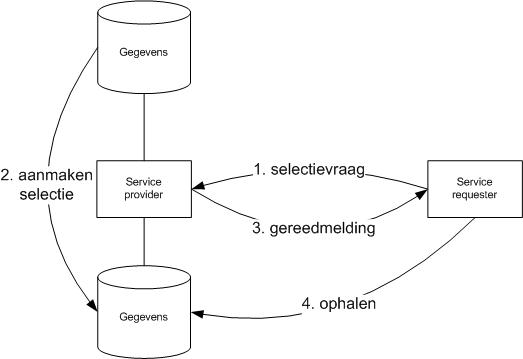
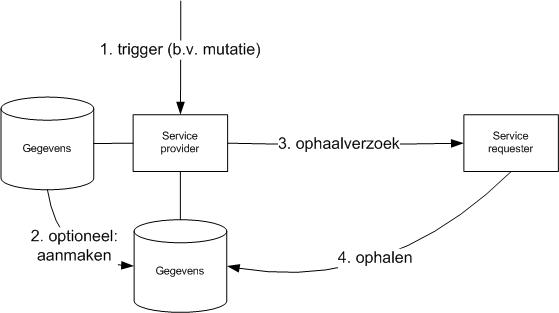
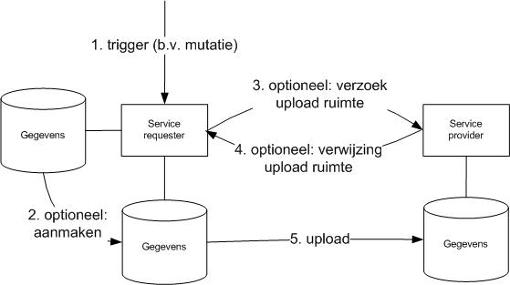

# Use cases

Bij de definitiestudie naar Digikoppeling Grote Berichten zijn een aantal use cases onderkend die bij de uitwerking van de standaard als referentie hebben gediend. Deze use-cases zijn bij toepassing van de standaard nuttig als inspiratiebron voor vormgeving van uitwisselingspatronen.

Dit hoofdstuk beschrijft deze use-cases en geeft aan hoe deze gerealiseerd kunnen worden. Daarbij maakt de uitwerking duidelijk of gegevens via ebMS2, WUS en/of als groot bericht verstuurd worden. Beschrijving van de use-cases is generiek; specifieke implementaties kunnen variëren maar zullen vaak deze generieke patronen als basis hebben.

## Download

In deze use case zijn benodigde gegevens al beschikbaar in een download-server. De afnemer dient echter nog de beschikking te krijgen over een referentie naar de gewenste gegevens. Daartoe worden de volgende processtappen doorlopen:

- De Afnemer bevraagt (WUS-request of eventueel ebMS2) de Service Provider met kenmerkende criteria voor de gezochte gegevens. Eventueel kan deze bevraging in enkele tussenstappen verlopen als deze initieel teveel mogelijkheden oplevert.

- De Service provider levert een verwijzing naar de gezochte gegevens in de vorm van Meta-data (WUS-response of ebMS2).

- De Afnemer haalt de gewenste gegevens op (Groot Bericht) en krijgt deze op grond van autorisatie (OIN).

## Selectie

In deze use case vraagt een Afnemer een gegevensselectie van een Service-verlener. Daartoe worden de volgende processtappen doorlopen:

1. De Afnemer bevraagt (ebMS2-request of eventueel WUS) de Service Provider met kenmerkende criteria voor de gezochte gegevens. Eventueel kan deze bevraging in enkele tussenstappen verlopen als deze initieel teveel mogelijkheden oplevert.

1. De Service Provider maakt de gewenste gegevens aan en zet deze klaar in een Groot Bestand.

1. Zodra het Grote Bestand gereed is, Meldt de Service Provider dit aan de eerdere Afnemer met een verwijzing naar de gezochte gegevens in de vorm van Meta-data (ebMS2).

1. De Afnemer haalt de gewenste gegevens op (Groot Bericht) en krijgt deze op grond van autorisatie (OIN).

Merk op dat deze use case vrijwel gelijk is aan “Download”. Alleen stap 2 'aanmaken selectie' is aanvullend. Vanwege de benodigde tijd van dit aanmaken kan gereedmelding niet via een WUS-response plaatsvinden en zal altijd ebMS2 toegepast moeten worden. Als het 'aanmaken van de selectie binnen de time-out van het WUS-request kan plaatsvinden ontstaat als vanzelf het “Download” pattern.

## Verzending

In deze use case verzendt een Afnemer gegevens naar een Service-verlener. Daartoe worden de volgende processtappen doorlopen:

1. Op enig moment is er een gebeurtenis waardoor de Service-provider besluit tot verzenden van gegevens. Voorbeelden van triggers zijn: tijd, bericht ontvangst of wijziging van gegevensobjecten.

1. Als gegevens niet beschikbaar zijn in de vorm van een Groot Bestand zal dit aangemaakt worden (bijvoorbeeld door samenstelling vanuit een database).

1. De Service Provider stuurt een 'verzoek tot ophalen' naar de Afnemer (ebMS2). In deze Melding is in ieder geval de Meta-data van het Grote Bestand opgenomen, maar kan bijvoorbeeld ook informatie over de aard en beoogde afhandeling van het Grote Bestand zijn opgenomen.

1. De Afnemer haalt de gegevens op (Groot Bericht) en krijgt deze verstrekt op grond van autorisatie (OIN).

Aanvullend kan het Grote Bestand ook verwijderd worden. Bijvoorbeeld nadat de expiration-time is verstreken of nadat de Afnemer een bericht heeft gestuurd om de succesvolle ontvangst te bevestigen.

Merk op dat deze interactie identiek is aan “Multi-distributie” maar slechts één (1) afnemer kent.

## Multi-distributie

In deze use case distribueert een Service-verlener gegevens naar meerdere Afnemers. Daartoe worden de volgende processtappen doorlopen:

 distributie'")

1. Op enig moment is er een gebeurtenis waardoor de Service-provider besluit tot distributie van gegevens. Voorbeelden van triggers zijn: tijd, bericht ontvangst of wijziging van gegevensobjecten.

1. Als gegevens niet beschikbaar zijn in de vorm van een Groot Bestand zal dit aangemaakt worden (bijvoorbeeld door samenstelling vanuit een database).

1. De Service Provider stuurt een Melding (ebMS2) naar de Afnemers die deze gegevens (bijvoorbeeld op basis van een abonnement) behoren te ontvangen. In deze Melding is in ieder geval de Meta-data van het Grote Bestand opgenomen, maar kan bijvoorbeeld ook informatie over de aard en beoogde afhandeling van het Grote Bestand zijn opgenomen. Alle Afnemers ontvangen dezelfde Meta-data.

1. Afnemers halen de gegevens op (Groot Bericht) en krijgen deze verstrekt op grond van autorisatie (OIN).

Aanvullend kan het Grote Bestand ook verwijderd worden. Bijvoorbeeld nadat de expiration-time is verstreken of nadat alle Afnemers een bericht hebben gestuurd om de succesvolle ontvangst te bevestigen.

## Upload

In deze use case upload een Afnemer gegevens naar een Service-verlener. Deze use case is alleen mogelijk met de 'brengen' interactie die de huidige versie niet ondersteund. De use case “verzenden” is functioneel hiermee gelijkwaardig maar past wel het 'halen' interactiepatroon toe. De processtappen van “upload” zijn daarom niet verder uitgewerkt.

## Business voorbeelden

| **Use case**        | **Voorbeeld**                                                                                 |
| --- |-----------------------------------------------------------------------------------------------|
| upload              | Zie voorbeelden van Verzending.                                                               |
| download            | Gegevens worden beschikbaar gesteld voor breed (openbaar) gebruik.                            |
| selectie            | Ad hoc informatieverzoeken voor het samenstellen van rapportages of doorsnedes van gegevens . |
| verzending          | Maandelijkse verzending van vast afgesproken gegevenssets.                                    |
| (multi-)distributie | Verstrekking van mutaties naar geabonneerde instanties.                                       |
